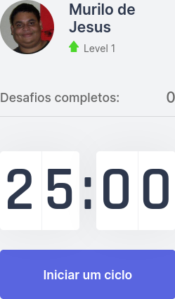
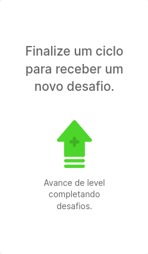

<h1 align="center">Move.It 🚀</h1>

<p align="center">
	
</p>

<p align="center">Projeto desenvolvido durante a 4ª edição do Next Level Week, idealizado pela <a href="https://github.com/rocketseat">Rocketseat</a>.</p>

### Link do deploy

<p>
	<a href="https://moveit-murilojssilva.vercel.app/">https://moveit-murilojssilva.vercel.app/</a>
</p>

### Funcionalidades

- [x] Cronômetro
- [x] Elevação do level
- [x] Pontuação
- [x] Lista de exercícios
- [x] Notificações
- [X] Deploy pelo Vercel

### Funcionalidades (desafios)
- [x] Criação do README
- [ ] Login com o GitHub
- [x] Dark Mode
- [ ] Responsividade
- [ ] Ranking

### Prints da aplicação

<p align="center">
	
</p>

<p align="center">
	
	
</p>

### Pré-requisitos

Antes de começar, você vai precisar ter instalado em sua máquina as seguintes ferramentas:
[Git](https://git-scm.com), [Node.js](https://nodejs.org/en/). 
Além disto é bom ter um editor para trabalhar com o código como [VSCode](https://code.visualstudio.com/)

### Rodando a aplicação

#### Clone do repositório

```shell
$ git clone <https://github.com/murilojssilva/NLW04-React>
```

#### Instale as dependêmcias

```shell
$ yarn add
```

#### Execute a aplicação em modo de desenvolvimento

```shell
$ yarn dev
```

#### O servidor iniciará na porta:3002 - acesse <http://localhost:3002>

### 🛠 Tecnologias

As seguintes ferramentas foram usadas na construção da aplicação:

- [React](https://pt-br.reactjs.org/)
- [TypeScript](https://www.typescriptlang.org/)